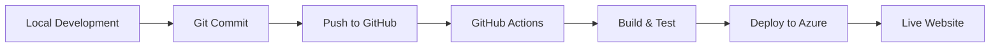

# 🚀 GitHub Deployment Guide - Real Estate Management System

## Complete Guide to Deploy Your ASP.NET Core Website Using GitHub

This guide covers deploying your Real Estate Management System to production using GitHub as your code repository and various deployment platforms.

---

## 📋 Prerequisites

- ✅ GitHub account (free at https://github.com)
- ✅ Git installed on your computer
- ✅ Your Real Estate Management System project
- ✅ Visual Studio 2022 or VS Code

---

## 🎯 Deployment Options from GitHub

1. **GitHub → Azure App Service** (Recommended for .NET apps)
2. **GitHub → Railway** (Easy, affordable)
3. **GitHub → Render** (Free tier available)
4. **GitHub → AWS Elastic Beanstalk**
5. **GitHub → Docker + Any Cloud**

---

## 📦 Part 1: Push Your Project to GitHub

### Step 1: Create GitHub Repository

1. Go to **https://github.com**
2. Click **"New"** or **"+"** → **"New repository"**
3. Fill in:
   ```
   Repository name: RealEstateManagementSystem
   Description: Full-stack Real Estate Management System with ASP.NET Core
   Visibility: Public (or Private)
   ✅ Add README (already have one)
   ```
4. Click **"Create repository"**

### Step 2: Initialize Git in Your Project

Open PowerShell in your project folder:

```powershell
cd C:\Users\HP\OneDrive\Desktop\Real\RealEstateManagementSystem

# Initialize Git (if not already)
git init

# Create .gitignore for .NET projects
```

### Step 3: Create .gitignore File

Create a file named `.gitignore` in your project root with this content:

```gitignore
# Build results
[Dd]ebug/
[Dd]ebugPublic/
[Rr]elease/
[Rr]eleases/
x64/
x86/
[Ww][Ii][Nn]32/
[Aa][Rr][Mm]/
[Aa][Rr][Mm]64/
bld/
[Bb]in/
[Oo]bj/
[Ll]og/
[Ll]ogs/

# Visual Studio cache/options
.vs/
.vscode/

# User-specific files
*.rsuser
*.suo
*.user
*.userosscache
*.sln.docstates

# Database files
*.mdf
*.ldf
*.ndf

# NuGet Packages
*.nupkg
*.snupkg
**/packages/*

# Publishing
publish/
*.pubxml
*.publishproj

# Dependencies
node_modules/

# Environment files
appsettings.Development.json
appsettings.Production.json
*.local.json

# Temporary files
*.tmp
*.log
```

### Step 4: Commit and Push to GitHub

```powershell
# Add all files
git add .

# Commit
git commit -m "Initial commit - Real Estate Management System"

# Add remote repository (replace YOUR_USERNAME with your GitHub username)
git remote add origin https://github.com/YOUR_USERNAME/RealEstateManagementSystem.git

# Push to GitHub
git branch -M main
git push -u origin main
```

**Enter your GitHub credentials when prompted**

---

## 🚀 Part 2: Deploy to Azure Using GitHub Actions (AUTOMATED)

This method automatically deploys your app whenever you push code to GitHub!

### Step 1: Create Azure App Service

#### Option A: Using Azure Portal

1. Go to **https://portal.azure.com**
2. Click **"Create a resource"**
3. Search **"Web App"**
4. Click **"Create"**

5. Fill in:
   ```
   Subscription: Your subscription
   Resource Group: Create new → "RealEstateRG"
   
   Instance Details:
   Name: dhanlakshmi-estates (choose unique name)
   Publish: Code
   Runtime stack: .NET 8 (LTS)
   Operating System: Windows
   Region: Choose nearest (e.g., East US)
   
   Pricing Plan:
   - Free F1 (for testing)
   - Basic B1 (for production - $13/month)
   ```

6. Click **"Review + Create"** → **"Create"**

#### Option B: Using Azure CLI

```bash
# Login to Azure
az login

# Create resource group
az group create --name RealEstateRG --location eastus

# Create app service plan
az appservice plan create --name DhanLakshmiPlan --resource-group RealEstateRG --sku B1

# Create web app
az webapp create --name dhanlakshmi-estates --resource-group RealEstateRG --plan DhanLakshmiPlan --runtime "DOTNET:8.0"
```

### Step 2: Enable GitHub Deployment

1. In **Azure Portal**, go to your App Service
2. Click **"Deployment Center"** (left menu)
3. Choose **"GitHub"** as source
4. Click **"Authorize"** and authorize Azure to access your GitHub
5. Select:
   ```
   Organization: Your GitHub username
   Repository: RealEstateManagementSystem
   Branch: main
   ```
6. Under **Build Provider**, select **"GitHub Actions"**
7. Click **"Save"**

### Step 3: Automatic Workflow File

Azure automatically creates `.github/workflows/azure-webapps-dotnet-core.yml` in your repository with deployment configuration.

### Step 4: Configure Database Connection

1. Create **Azure SQL Database** (see AZURE_DEPLOYMENT_GUIDE.md)
2. In App Service → **Configuration** → **Connection strings**
3. Add:
   ```
   Name: DefaultConnection
   Value: [Your Azure SQL connection string]
   Type: SQLAzure
   ```
4. Click **"Save"**

### Step 5: Deploy!

Now every time you push to GitHub:

```powershell
git add .
git commit -m "Update feature"
git push origin main
```

GitHub Actions automatically:
- ✅ Builds your app
- ✅ Runs tests
- ✅ Deploys to Azure
- ✅ Applies migrations

Check deployment status: **GitHub Repository → Actions tab**

---

## 🌐 Part 3: Deploy to Railway (Easy Alternative)

Railway is a modern platform with simple GitHub integration.

### Step 1: Create Railway Account

1. Go to **https://railway.app**
2. Click **"Login with GitHub"**
3. Authorize Railway

### Step 2: Create New Project

1. Click **"New Project"**
2. Select **"Deploy from GitHub repo"**
3. Choose your **RealEstateManagementSystem** repository
4. Railway automatically detects .NET project

### Step 3: Add Database

1. Click **"+ New"** in your project
2. Select **"Database"** → **"PostgreSQL"** or **"MySQL"**
3. Database is automatically provisioned

### Step 4: Configure Environment Variables

1. Click on your web service
2. Go to **"Variables"** tab
3. Add:
   ```
   ASPNETCORE_ENVIRONMENT=Production
   ConnectionStrings__DefaultConnection=[Railway database connection string]
   ```

### Step 5: Deploy

Railway automatically deploys! Your app will be live at:
```
https://your-app-name.up.railway.app
```

**Cost**: 
- Free tier: $5 credit/month
- Paid: ~$5-10/month

---

## 🎨 Part 4: Deploy to Render (Free Option)

Render offers free hosting for web apps.

### Step 1: Create Render Account

1. Go to **https://render.com**
2. Click **"Get Started for Free"**
3. Sign up with GitHub

### Step 2: Create Web Service

1. Click **"New +"** → **"Web Service"**
2. Connect your GitHub repository
3. Select **RealEstateManagementSystem**

### Step 3: Configure Service

```
Name: real-estate-system
Environment: .NET
Build Command: dotnet publish -c Release -o out
Start Command: dotnet out/RealEstateManagementSystem.dll

Plan: Free
```

### Step 4: Add Database

1. Click **"New +"** → **"PostgreSQL"**
2. Name: realestate-db
3. Select **Free** tier

### Step 5: Add Environment Variables

In your web service settings:
```
ASPNETCORE_ENVIRONMENT=Production
ASPNETCORE_URLS=http://+:10000
ConnectionStrings__DefaultConnection=[Database URL from Render]
```

### Step 6: Deploy

Click **"Create Web Service"** - Render automatically deploys!

**URL**: `https://real-estate-system.onrender.com`

**Cost**: FREE (with limitations)

---

## 🔄 Part 5: Custom GitHub Actions Workflow

Create `.github/workflows/deploy.yml` for custom deployment:

```yaml
name: Deploy to Production

on:
  push:
    branches: [ main ]
  pull_request:
    branches: [ main ]

jobs:
  build-and-deploy:
    runs-on: windows-latest
    
    steps:
    - name: Checkout code
      uses: actions/checkout@v3
    
    - name: Setup .NET
      uses: actions/setup-dotnet@v3
      with:
        dotnet-version: '8.0.x'
    
    - name: Restore dependencies
      run: dotnet restore
    
    - name: Build
      run: dotnet build --configuration Release --no-restore
    
    - name: Test
      run: dotnet test --no-restore --verbosity normal
    
    - name: Publish
      run: dotnet publish -c Release -o ./publish
    
    - name: Deploy to Azure Web App
      uses: azure/webapps-deploy@v2
      with:
        app-name: 'dhanlakshmi-estates'
        publish-profile: ${{ secrets.AZURE_WEBAPP_PUBLISH_PROFILE }}
        package: './publish'
```

### Add Publish Profile Secret

1. In Azure Portal → App Service → **Get publish profile**
2. Download the file
3. In GitHub → Repository → **Settings** → **Secrets and variables** → **Actions**
4. Click **"New repository secret"**
5. Name: `AZURE_WEBAPP_PUBLISH_PROFILE`
6. Value: Paste content of publish profile file
7. Click **"Add secret"**

---

## 🐳 Part 6: Deploy Using Docker + GitHub

### Step 1: Create Dockerfile

Create `Dockerfile` in project root:

```dockerfile
FROM mcr.microsoft.com/dotnet/aspnet:8.0 AS base
WORKDIR /app
EXPOSE 80
EXPOSE 443

FROM mcr.microsoft.com/dotnet/sdk:8.0 AS build
WORKDIR /src
COPY ["RealEstateManagementSystem.csproj", "./"]
RUN dotnet restore "RealEstateManagementSystem.csproj"
COPY . .
RUN dotnet build "RealEstateManagementSystem.csproj" -c Release -o /app/build

FROM build AS publish
RUN dotnet publish "RealEstateManagementSystem.csproj" -c Release -o /app/publish

FROM base AS final
WORKDIR /app
COPY --from=publish /app/publish .
ENTRYPOINT ["dotnet", "RealEstateManagementSystem.dll"]
```

### Step 2: Create .dockerignore

```
**/bin/
**/obj/
**/out/
.vs/
.git/
```

### Step 3: Build and Push to Docker Hub

```bash
# Build Docker image
docker build -t yourusername/real-estate-system:latest .

# Login to Docker Hub
docker login

# Push image
docker push yourusername/real-estate-system:latest
```

### Step 4: Deploy to Any Cloud

Now you can deploy this Docker container to:
- **Azure Container Instances**
- **AWS ECS**
- **Google Cloud Run**
- **DigitalOcean App Platform**
- **Heroku**

---

## 📊 Deployment Comparison

| Platform | Cost | Ease | CI/CD | Database | Best For |
|----------|------|------|-------|----------|----------|
| **Azure App Service** | $13-18/mo | ⭐⭐⭐⭐ | ✅ Auto | SQL Server | Production .NET apps |
| **Railway** | $5-10/mo | ⭐⭐⭐⭐⭐ | ✅ Auto | PostgreSQL | Quick deployment |
| **Render** | Free-$7/mo | ⭐⭐⭐⭐⭐ | ✅ Auto | PostgreSQL | Free tier testing |
| **AWS EB** | $15-25/mo | ⭐⭐⭐ | Manual | RDS | Enterprise |
| **Docker** | Varies | ⭐⭐⭐ | Custom | Any | Flexibility |

---

## ✅ Post-Deployment Checklist

- [ ] Push code to GitHub repository
- [ ] Choose deployment platform
- [ ] Create web service/app
- [ ] Add database (SQL Server, PostgreSQL, MySQL)
- [ ] Configure connection strings
- [ ] Set environment variables
- [ ] Enable HTTPS/SSL
- [ ] Apply database migrations
- [ ] Test login functionality
- [ ] Upload logo and images
- [ ] Configure custom domain (optional)
- [ ] Set up monitoring/logging
- [ ] Enable automatic backups

---

## 🔐 Environment Variables Reference

Add these to your hosting platform:

```bash
# Required
ASPNETCORE_ENVIRONMENT=Production
ConnectionStrings__DefaultConnection=[Your database connection string]

# Optional
ASPNETCORE_URLS=http://+:80
ASPNETCORE_HTTPS_PORT=443
```

---

## 🎯 Recommended Workflow



---

## 🔧 Troubleshooting

### Build fails in GitHub Actions
- Check .NET version in workflow matches project
- Verify all NuGet packages are restored

### Database connection fails
- Verify connection string format
- Check firewall rules allow your hosting platform

### Application doesn't start
- Check logs in your hosting platform
- Verify environment variables are set
- Ensure migrations are applied

### GitHub Actions not triggering
- Check workflow file syntax
- Verify you pushed to correct branch (main)
- Check Actions tab for errors

---

## 📞 Support Resources

- **GitHub Actions Docs**: https://docs.github.com/actions
- **Azure Deployment**: https://docs.microsoft.com/azure/app-service/
- **Railway Docs**: https://docs.railway.app
- **Render Docs**: https://render.com/docs

---

## 🎉 Success!

Your website is now deployed and accessible worldwide!

### Live URLs Examples:
```
Azure: https://dhanlakshmi-estates.azurewebsites.net
Railway: https://realestate.up.railway.app
Render: https://real-estate-system.onrender.com
```

### Share Your Credentials:
```
🔐 Admin Login:
Email: admin@realestate.com
Password: Admin@123

🔐 User Login:
Email: john.doe@example.com
Password: User@123
```

---

## 📈 Next Steps

1. **Custom Domain**: Point your domain to hosting platform
2. **SSL Certificate**: Enable HTTPS (usually free with Let's Encrypt)
3. **Monitoring**: Set up Application Insights or similar
4. **Backups**: Configure automatic database backups
5. **Email Service**: Integrate SendGrid or similar for notifications
6. **CDN**: Add Cloudflare for better performance

---

**Created for: Real Estate Management System**
**Technology: ASP.NET Core 8.0 MVC**
**Date: 2025**

Happy Deploying! 🚀
